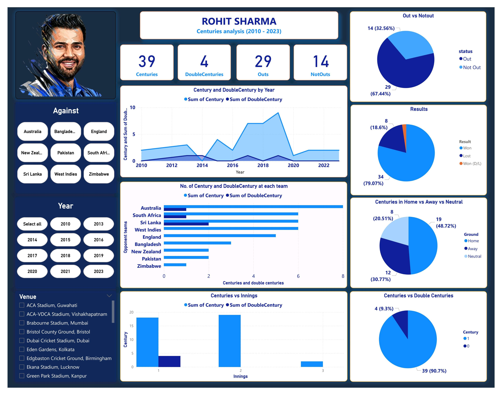

# Rohitsharma_Centuries_Dashborad
# 🏏 Rohit Sharma Centuries Analysis (2010-2023) – Power BI Dashboard  

## 📊 Overview  
This project is a **Power BI dashboard** that provides an in-depth analysis of **Rohit Sharma's centuries** from **2010 to 2023**. It visualizes key insights such as:  

- 📅 **Centuries & Double Centuries by Year**  
- 🏏 **Performance Against Different Teams**  
- 🌍 **Home vs Away vs Neutral Stats**  
- 🎯 **Match Outcomes & Not-out Ratios**  

## 🚀 Features  
- **Interactive Visualizations** 📊  
- **Team-wise Performance Breakdown** 🏏  
- **Century & Double Century Insights** 🔥  
- **Match Winning Contributions** 🏆  

## 📷 Dashboard Preview  
  

## 🛠️ Tools Used  
- **Power BI** – Data Visualization  
- **DAX** – Data Analysis Expressions  
- **Excel/CSV** – Data Processing  

## 📂 Dataset  
The dataset includes **Rohit Sharma’s batting records** extracted from publicly available cricket data sources.  

## 📌 How to Use  
1. Open the **Power BI file (.pbix)** in Power BI Desktop.  
2. Explore different visualizations and filters to analyze the data.  
3. Modify or enhance the dashboard as needed.  

## 🎯 Future Improvements  
- **Live data integration** using APIs 📡  
- **More player comparisons & insights** 🔍  
- **Advanced statistical analysis** 📊  

## 🔗 Connect with Me  
💼 [LinkedIn](https://www.linkedin.com/in/bhavyrajsinh-chavda/) | 📧 bhavyrajsinh@example.com  

📌 If you find this project useful, feel free to ⭐ the repo and contribute!  

---

#PowerBI #DataAnalytics #CricketStats #Dashboard #RohitSharma #DataVisualization #CricketLovers  
